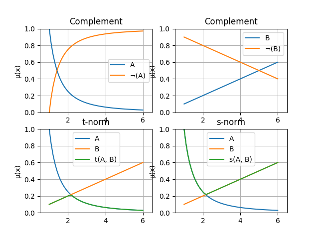

# Table of Contents
 * [Triangular fuzzy numbers](#triangular-fuzzy-numbers)
 * [Fuzzy sets](#fuzzy-sets)
 * [Plotting](#plotting)

# fuzzysets
**fuzzysets** is a simple Python package that is well suited for interactive experiments with fundamental concepts in fuzzy set theory.  

# Installation
The package is available on [PYPI](https://pypi.org/project/fuzzysets/) and can be installed with pip:  
`pip install fuzzysets`  

# Notation
In the following sections, code snippets will be highlighted like this.  

```python
import fuzzysets as fs
```

Examples involving a read-evaluate-print loop will show both the Python statement, which will be preceded by a `>>>` prompt, and its output, if any.  

<a name="triangular-fuzzy-numbers"></a>
## Triangular fuzzy numbers
One of the concepts implemented by **fuzzysets** is a triangular fuzzy number (TFN), represented with the *TriangularFuzzyNumber* class.  

Each TFN can be uniquely represented as a 3-tuple of real numbers (left, peak, right) (l, n and r below) where:

 - peak is the number whose membership degree is 1, that is, the number being modeled
 - left (< peak) and right (> peak) determine the fuzzy number's membership function:
    - mu(x) = 0, x ∈ (-inf, l) U (r, +inf)
    - mu(x) = (x - l) / (n - l), l <= x <= n
    - mu(x) = (r - x) / (r - n), n <= x <= r

The TriangularFuzzyNumber class offers a more complex abstraction than that.  

We first need to import the **fuzzysets** package:  

```python
>>> import fuzzysets as fs
```

The class is available through an alias - TFN. The default value of the class is 0:  

```python
>>> fs.TFN()
TriangularFuzzyNumber(l=-1.0, n=0.0, r=1.0)
```

As you can see, the *left* and *right* properties are offset by 1 by default. We could create a TFN that models any number like this:  

```python
>>> fs.TFN(11.5)
TriangularFuzzyNumber(l=10.5, n=11.5, r=12.5)
```

It is also possible to set one or both of the other properties:  

```python
>>> fs.TFN(10, r=12.8)
TriangularFuzzyNumber(l=9.0, n=10.0, r=12.8)
>>> fs.TFN(10.6, 8, 12)
TriangularFuzzyNumber(l=8.0, n=10.6, r=12.0)
```

Since the order of the arguments may seem a bit odd, a TFN can also be created from a tuple:  

```python
>>> tfn = fs.TFN.from_tuple((0, 1, 2.5))
>>> tfn
TriangularFuzzyNumber(l=0.0, n=1.0, r=2.5)
```

We can call the membership function of the TFN like this:  

```python
>>> tfn.mu(-1)
0
>>> tfn.mu(0.5)
0.5
>>> tfn.mu(1)
1.0
>>> tfn.mu(2.)
0.3333333333333333
```

Arithmetic operations on TFNs can be done with the corresponding operators:  

```python
>>> n = tfn.from_tuple((1, 2, 4))
>>> m = tfn.from_tuple((2, 4, 6))
>>> n + m
TriangularFuzzyNumber(l=3.0, n=6.0, r=10.0)
>>> n - m
TriangularFuzzyNumber(l=-5.0, n=-2.0, r=2.0)
>>> n * m
TriangularFuzzyNumber(l=2.0, n=8.0, r=24.0)
>>> n / m
TriangularFuzzyNumber(l=0.16666666666666666, n=0.5, r=2.0)
>>> -n
TriangularFuzzyNumber(l=-4.0, n=-2.0, r=-1.0)  
```

There are also predicates for (proper) subset and equality tests:  

```python
>>> fs.TFN.from_tuple((1.2, 2, 4)) < fs.TFN.from_tuple((1, 2, 4))
True
>>> n <= n
True
>>> m > m
False
>>> fs.TFN.from_tuple((1, 2, 3)) >= fs.TFN.from_tuple((1, 2.1, 3))
False
>>> n == n
True
>>> n != m
True
```

We can also obtain the alpha cut of a TFN:  

```python
>>> n
TriangularFuzzyNumber(l=1.0, n=2.0, r=4.0)
>>> n.alpha_cut
AlphaCut(1.0 + alpha * 1.0, 4.0 + alpha * -2.0)
```

It can be converted to a more user-friendly string than the one above and can compute the interval for a fixed alpha:  

```python
>>> cut = n.alpha_cut
>>> str(cut)
'[1.0 + alpha * 1.0, 4.0 + alpha * -2.0]'
>>> cut.for_alpha(0.5)
(1.5, 3.0)
```

TFNs are also hashable which means that we can store them in sets or use them as mapping keys:  

```python
>>> {fs.TFN(i) for i in range(2)}
{TriangularFuzzyNumber(l=0.0, n=1.0, r=2.0), TriangularFuzzyNumber(l=-1.0, n=0.0, r=1.0)}
>>> mapping = {fs.TFN(): "zero", fs.TFN(1): "one"}
>>> mapping
{TriangularFuzzyNumber(l=-1.0, n=0.0, r=1.0): 'zero', TriangularFuzzyNumber(l=0.0, n=1.0, r=2.0): 'one'}
```

We can also obtain the basic attributes of a TFN:  

```python
>>> n
TriangularFuzzyNumber(l=1.0, n=2.0, r=4.0)
>>> n.left
1.0
>>> n.peak
2.0
>>> n.right
4.0
```

TFNs are also iterable, their attributes are yielded in order from left to right. This means that we can unpack them just like tuples: 

```python
>>> a, b, c = n
>>> a
1.0
>>> b
2.0
>>> c
4.0
```

<a name="fuzzy-sets"></a>

## Fuzzy sets
Another concept implemented in **fuzzysets** is a fuzzy set! But first, lets start with their domains.  

### Domains
There are two types of domains - ones for finite and continuous membership functions. Let's start with finite ones.  

They are represented with the *FiniteDomain* class. It can be created from any iterable of hashable items, like a list of string or numeric values:  

```python
>>> fs.FiniteDomain(["a", "b", "c"])
FiniteDomain({'b', 'c', 'a'})
```

As you can see, it is not ordered. It is iterable, however, and each time you iterate it, you get its elements in the exact same order. We can iterate it in a `for` loop of create a list from it:  

```python
>>> domain = fs.FiniteDomain(["a", "b", "c"])
>>> list(domain)
['b', 'c', 'a']
```

We can also check whether a value is within it or whether it is equal to another domain:  

```python
>>> "d" in domain
False
>>> "z" not in domain
True
>>> fs.FiniteDomain(["a"]) == fs.FiniteDomain(["c"])
False
```

Continuous domains are very similar, but they represent a range of real numbers: [start, end]. Since a domain may need to be iterated, we would need to approximate the iteration with a finitely small step:  

```python
>>> fs.ContinuousDomain(0.0, 1.0)
ContinuousDomain(start=0.0, end=1.0, step=0.1)
```

As you can see the step defaults to 0.1, but we can pick it too:  

```python
>>> domain = fs.ContinuousDomain(0.0, 1.0, 0.2)
>>> domain
ContinuousDomain(start=0.0, end=1.0, step=0.2)
```

Again, we can iterate a domain, check whether something is within it and check whether it is equal to another domain (the equality test does not consider the step):  

```python
>>> list(domain)
[0.0, 0.2, 0.4, 0.6000000000000001, 0.8, 1.0]
>>> -1 in domain
False
>>> fs.ContinuousDomain(1., 2., 0.0001) == fs.ContinuousDomain(1., 2., 0.1)
True
```

### Sets
With domains out of the way, we can finally look at fuzzy sets. Let's start with finite ones again.  

Finite fuzzy sets are represented by the *FiniteFuzzySet* class, it can be created from any mapping whose keys are the elements of the set and whose values are their corresponding membership degrees:  

```python
>>> s = fs.FiniteFuzzySet({"a": 0.0, "b": 0.5, "c": 1.0})
>>> s
FiniteFuzzySet(FiniteDomain({'b', 'c', 'a'}))
```

We can convert the set into a string in the commonly used format:  

```python
>>> str(s)
'b/0.50 + c/1.00 + a/0.00'
```

We can also obtain the membership degree of an element, defaulting to 0 for elements which are not part of the domain:  

```python
>>> s.mu("b")
0.5
>>> s.mu("z")
0.0
```

We can obtain the set's domain:  

```python
>>> s.domain
FiniteDomain({'b', 'c', 'a'})
```

Its range is also available but as a generator so, unless we want to iterate it, we have to convert it to a collection (like a list):  

```python
>>> list(s.range)
[0.5, 1.0, 0.0]
>>> for d in s.range: print(d)
0.5
1.0
0.0
```

We can also iterate over the domain elements and their degrees at the same time by iterating the set itself:  

```python
>>> for x, d in s: print(x, d)
b 0.5
c 1.0
a 0.0
```

Fuzzy sets also have properties for core, support, cross over points and height (the first three return immutable sets):  

```python
>>> str(s)
'b/0.50 + c/1.00 + a/0.00'
>>> s.core
frozenset({'c'})
>>> s.support
frozenset({'b', 'c'})
>>> s.cross_over_points
frozenset({'b'})
>>> s.height
1.0
```

The alpha cut method of fuzzy sets returns a (mutable) set:  

```python
>>> s.alpha_cut(0.4)
{'b', 'c'}
```

There are also predicates for (proper) subset and equality tests:  

```python
>>> fs.FiniteFuzzySet({"a": 0.1, "b": 0.2}) < fs.FiniteFuzzySet({"a": 0.1, "b": 0.3})
True
>>> fs.FiniteFuzzySet({"a": 0.1, "b": 0.2}) >= fs.FiniteFuzzySet({"a": 0.1})
False
>>> s == s
True
>>> fs.FiniteFuzzySet({"a": 0.1, "b": 0.2}) != fs.FiniteFuzzySet({"a": 0.1, "b": 0.3})
True
>>> fs.FiniteFuzzySet({"a": 0.1, "b": 0.2}) == fs.FiniteFuzzySet({"a": 0.1})
False
```

We can also obtain the t-norm, s-norm and complement of fuzzy sets. This is possible via invoking methods like this:  

```python
a.t_norm(b)
b.s_norm(c)
c.complement()
```

It is also possible to do this via a function, these are equivalent:  

```
fs.t_norm(a, b) and a.t_norm(b)
fs.s_norm(a, b) and a.s_norm(b)  
fs.complement(c) and c.complement  
```

Let's take a look at a few examples:

```python
>>> a = fs.FiniteFuzzySet({"a": 0, "b": 0.5, "c": 1.})
>>> b = fs.FiniteFuzzySet({"a": 0.1, "b": 0.4, "c": 0.7})
>>> t_norm = fs.t_norm(a, b)
>>> str(t_norm)
'a/0.00 + b/0.40 + c/0.70'
>>> s_norm = fs.s_norm(a, b)
>>> str(s_norm)
'a/0.10 + b/0.50 + c/1.00'
>>> complement = fs.complement(a)
>>> str(complement)
'a/1.00 + b/0.50 + c/0.00'
```

As you can see, these default to min, max and *1 - x* but we can pick the norm too. We can pass in any callable to do the point-wise operations. For example, we can define a function or pass in an anonymous function:  

```python
>>> str(a)
'b/0.50 + c/1.00 + a/0.00'
>>> str(b)
'b/0.40 + c/0.70 + a/0.10'
>>> s_norm = fs.s_norm(a, b, lambda x, y: x * y)
>>> str(s_norm)
'a/0.00 + b/0.20 + c/0.70'
>>> def probabilistic_t_norm(a, b):
>>>     return a + b - a * b
>>> t_norm = fs.t_norm(a, b, probabilistic_t_norm)
>>> str(t_norm)
'a/0.10 + b/0.70 + c/1.00'
```

We can do that with methods too:  

```python
>>> str(a.complement(lambda x: 1.0 - x))
'a/1.00 + b/0.50 + c/0.00'
```

Another method that is also available as a function is the one for alpha cuts:  

```python
>>> fs.alpha_cut(a, alpha=0.1)
{'b', 'c'}
```

The other type of available fuzzy sets is that of fuzzy sets whose domains are intervals of real numbers. These are represented by the *ContinuousFuzzySet* class.  

In order to create such a set, we need to specify its domain and supply a callable that computes the membership degree whenever given a number in the domain. Again, this callable can be a function or an anonymous function:  

```python
>>> domain = fs.ContinuousDomain(1.0, 5.0, step=0.5)
>>> s = fs.ContinuousFuzzySet(domain, mu=lambda x: 1.0 / x)
>>> s
ContinuousFuzzySet(ContinuousDomain(start=1.0, end=5.0, step=0.5))
>>> str(s)
'1.0/1.00 + 1.5/0.67 + 2.0/0.50 + 2.5/0.40 + 3.0/0.33 + 3.5/0.29 + 4.0/0.25 + 4.5/0.22 + 5.0/0.20'
```

Everything else is just like with finite fuzzy sets. The only thing to note is that whenever we're operating on two continuous fuzzy sets with the same domain but with different steps, then the smaller of the two steps is used:  

```python
>>> s.mu(0.5)
0.0
>>> s.mu(1)
1.0
>>> s.domain
ContinuousDomain(start=1.0, end=5.0, step=0.5)
>>> set(s.range)
{0.6666666666666666, 1.0, 0.3333333333333333, 0.5, 0.4, 0.2857142857142857, 0.25, 0.2222222222222222, 0.2}
>>> s.core
frozenset({1.0})
>>> s.alpha_cut(0.65)
{1.0, 1.5}
>>> s.domain
ContinuousDomain(start=1.0, end=5.0, step=0.5)
>>> s == fs.ContinuousFuzzySet(fs.ContinuousDomain(1.0, 5.0, step=0.1), mu=lambda x: 1.0 / x)
True
>>> s < s
False
>>> s >= s
True
>>> fs.t_norm(s, s) == s
True
>>> fs.s_norm(s, s) == s
True
```

<a name="plotting"></a>

## Plotting
The things discussed above wouldn't be of much use if there was not any way to plot fuzzy sets. That's why **fuzzysets** provides a few functions for plotting fuzzy sets and results of operations on them.

The first one is *plot_fuzzy_set* which plots a finite or continuous fuzzy set:  

```python
>>> finite_set = fs.FiniteFuzzySet({"a": 0.3, "b": 0.37, "c": 0.86, "d": 0.4})
>>> fs.plot_fuzzy_set(finite_set)
```

  

We can also set the title, x label or y label (as well as all of them):  

```python
>>> continuous_set = fs.ContinuousFuzzySet(fs.ContinuousDomain(1., 6.), mu=lambda x: 1 / (x ** 2))
>>> fs.plot_fuzzy_set(continuous_set, title="Very young kid", x_label="Years")
```

  

The next plotting function is *plot_fuzzy_set_operations* which takes two fuzzy sets with equal domains and plots their complements, t-norm and s-norm:  

```python
>>> young_kid = fs.ContinuousFuzzySet(fs.ContinuousDomain(1., 6.), mu=lambda x: 1 / (x ** 2))
>>> speaking_ability = fs.ContinuousFuzzySet(young_kid.domain, mu=lambda x: x / 10.0)
>>> fs.plot_fuzzy_set_operations(young_kid, speaking_ability)
```

  

As you can, see the default names given to sets are not very informative but we can change them. We can also change the point-wise norms, just like with calls to `t_norm` and `s_norm`:  

```python
>>> fs.plot_fuzzy_set_operations(
        young_kid,
        speaking_ability,
        a_name="Young kid",
        b_name="Speaking ability",
        t_norm=lambda x, y: x * y,
        s_norm=lambda x, y: x + y - x * y,
        comp=lambda x: 1.0 - x
    )
```

  

We can also plot TFNs, this is done via the *plot_tfn* function:  

```python
>>> around_two = fs.TFN(2)
>>> fs.plot_tfn(around_two, name="Around 2")
```

  
The `name` argument which we set to `"Around 2"` above is optional, if we omit it, it will default to `"A"`.  

The last function is *plot_tfn_operations* which reads two TFNs as input and plots the results of their addition, subtraction, multiplication and division. The two TFNs' domains are subsets of [1, 10] and the TFNs are named 'A' and 'B' by default, but we can change any or all of these:  

```python
>>> fs.plot_tfn_operations(first_name="S", second_name="T", x_lim=(2.0, 11.0))
```

First we have to click to start the definition of the first TFN:  
  

Then we pick the corners of the TFN with mouse clicks:  
  

We need to confirm we are happy with the defined TFN:  
  

Then we have to click to start the definition of the second TFN:  
  

Finally, after confirming we are happy with the second TFN, we are shown the two TFNs and the results of the operations:   
  
  
